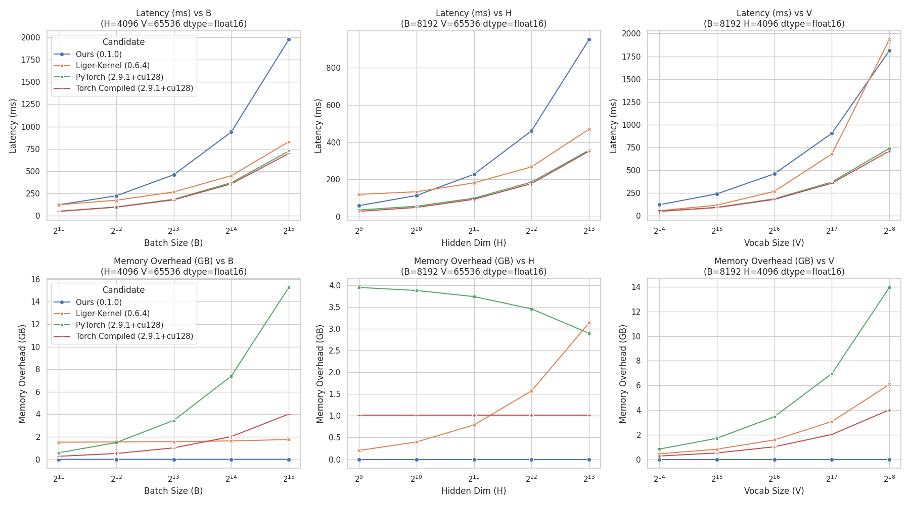

# Fused Cross-Entropy in Triton

A Triton implementation of the Fused Cross-Entropy loss function.

## Installation

```bash
pip install git+https://github.com/klae01/fused-cross-entropy.git
```

## Development

This project uses `ruff` for linting/formatting and `pytest` for numerical validation, managed via `pre-commit`.

### Setup

1.  Clone the repository.
2.  Install development dependencies and pre-commit hooks:
    ```bash
    pip install -e .[dev]
    pre-commit install
    ```

### Running Tests

The test suite validates the numerical accuracy of the Triton kernels against the native PyTorch implementation using Triton's CPU interpreter. The pre-commit hook runs these tests automatically, but you can also run them manually:

```bash
# This forces the Triton interpreter (CPU backend)
TRITON_INTERPRET=1 pytest
```

## Benchmarking

Run the benchmark suite to compare performance against baselines.

### Usage

```bash
uv run --group benchmark benchmarks/run_benchmark.py --mode orchestrator --output_dir assets
```

### Results


